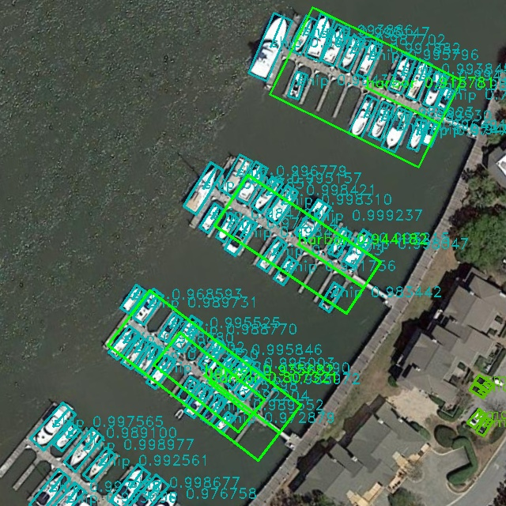
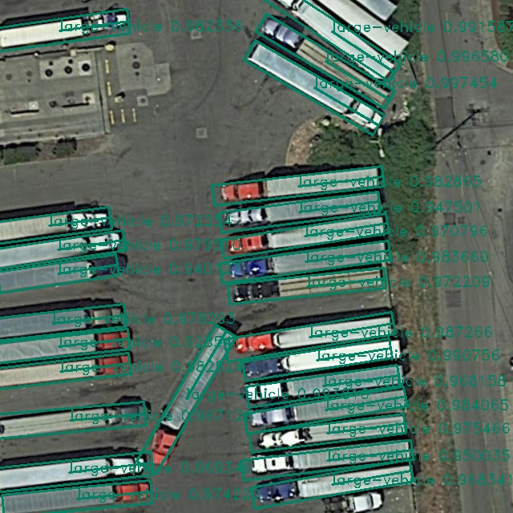
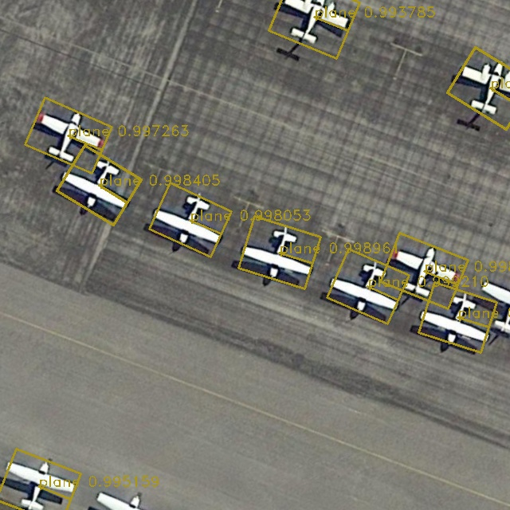
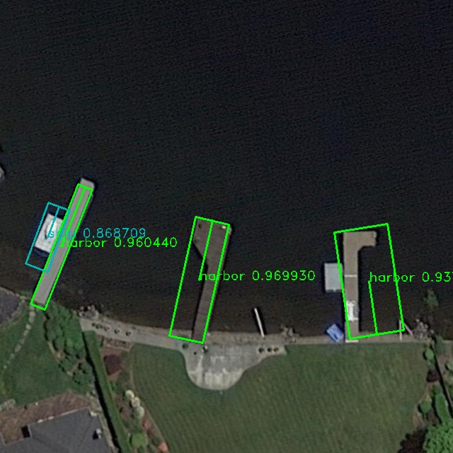
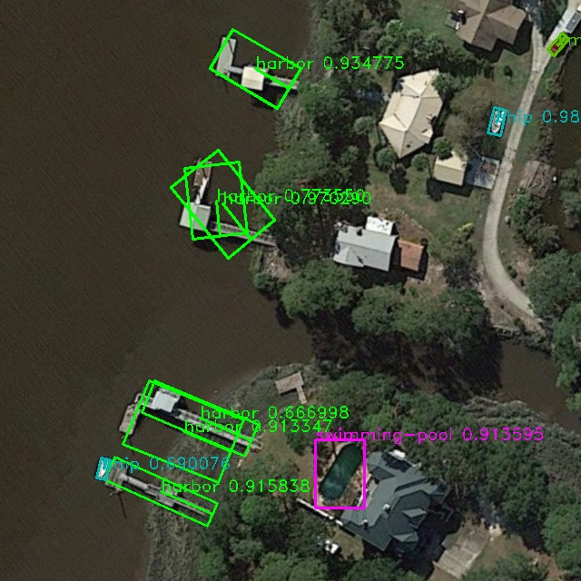
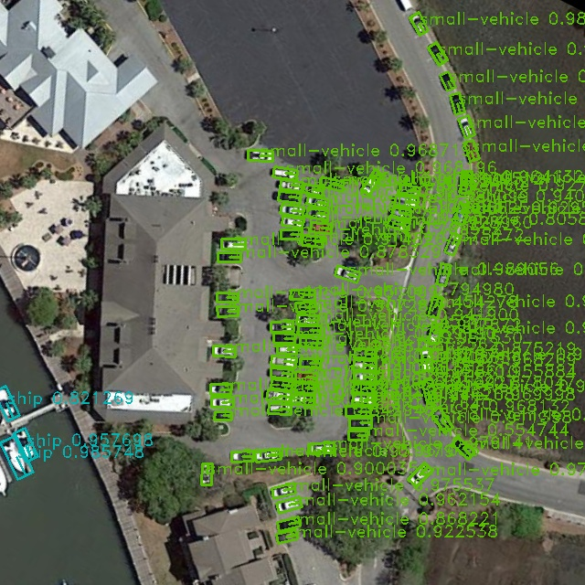
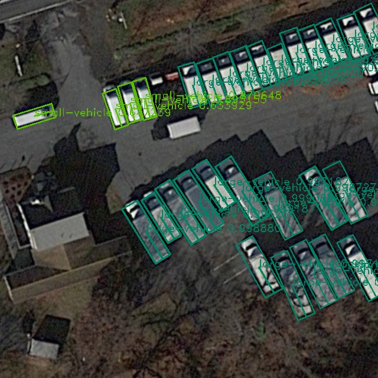

IMT
# version IMT04-release

IMT is a new type of C++ engine with the following main new features:

It supports IMT transformations, maintaining weight synchronization and adaptation during model structural changes. This will save a significant amount of training time and retain information from the original pre-training data. One training session can generate a group of models instead of just one single model. Related code can be found in src\model_trans\ directory.

It offers powerful object detection extension features, including prediction of multiple secondary attributes of a target, 6DPose (three-dimensional position and posture target detection), and recognition of inclined targets in remote sensing.

It is convenient for embedded porting. Based on the IMT framework, you can write the model into the embedded system during the training process, facilitating the implementation of AI applications on various small-scale devices. This is something current mainstream deep learning frameworks like mmd cannot achieve.

Rotated Object Detection Demos

Note: Although many documents claim to be Oriented Object Bounding Box detection, what they actually obtain are directionless quadrilaterals. However, our model achieves true directional object detection in its real sense.
Additionally, we can support a hybrid model that simultaneously detects both rotating boxes and horizontal boxes, as some targets are centrally symmetrical and do not require rotating boxes.