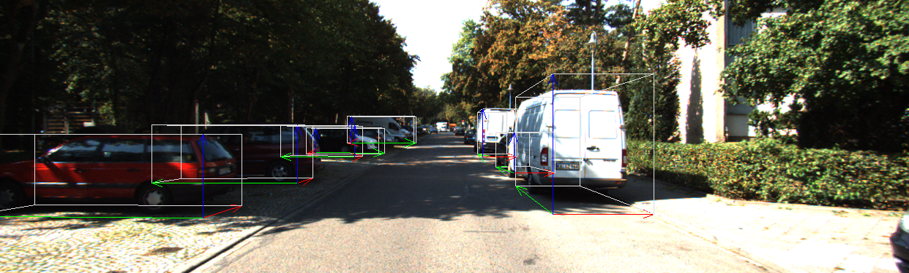
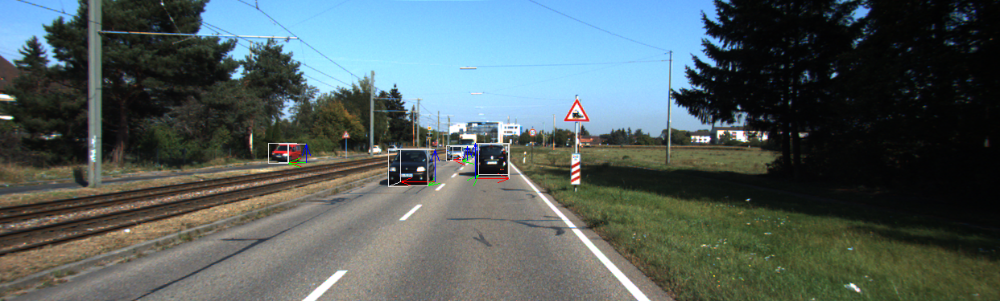
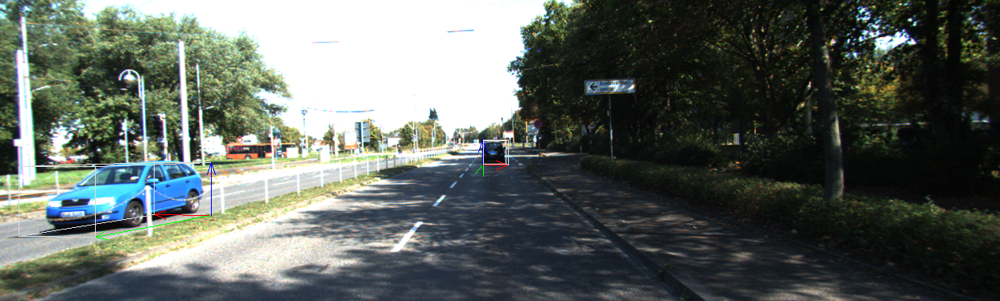
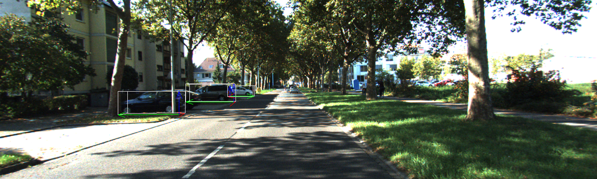
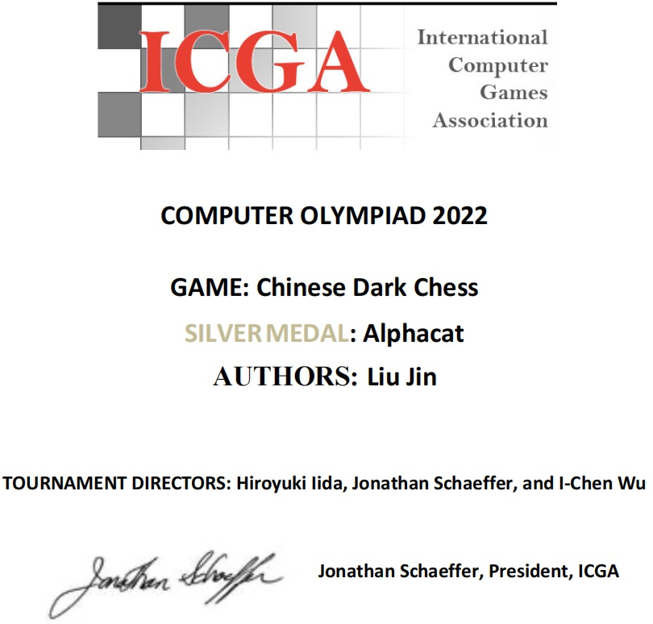
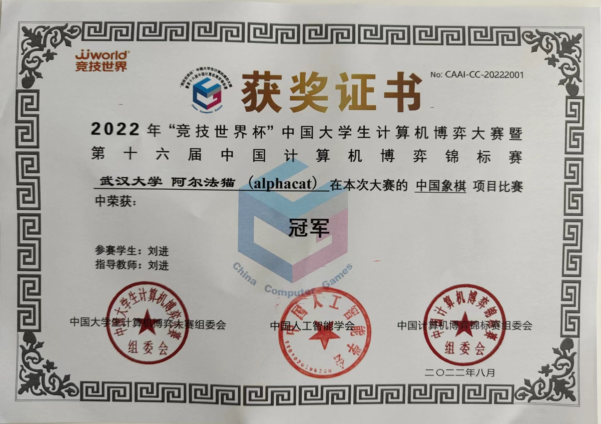

IMT
# version IMT04-release

IMT is a new type of C++ engine with the following main new features:

It supports IMT transformations, maintaining weight synchronization and adaptation during model structural changes. This will save a significant amount of training time and retain information from the original pre-training data. One training session can generate a group of models instead of just one single model. Related code can be found in src\model_trans\ directory.

It offers powerful object detection extension features, including prediction of multiple secondary attributes of a target, 6DPose (three-dimensional position and posture target detection), and recognition of inclined targets in remote sensing.

It is convenient for embedded porting. Based on the IMT framework, you can write the model into the embedded system during the training process, facilitating the implementation of AI applications on various small-scale devices. This is something current mainstream deep learning frameworks like mmd cannot achieve.

Rotated Object Detection Demos

Note: Although many documents claim to be Oriented Object Bounding Box detection, what they actually obtain are directionless quadrilaterals. However, our model achieves true directional object detection in its real sense.
Additionally, we can support a hybrid model that simultaneously detects both rotating boxes and horizontal boxes, as some targets are centrally symmetrical and do not require rotating boxes.

Turbo 6DPose Object Detection Demos

Note: The common 6DPose can only estimate the pose with one degree of freedom rotation - the heading angle, and it requires the exterior orientation parameters of the camera. However, our IMT engine's Turbo 6DPose can genuinely estimate the target's three degrees of freedom rotational pose relative to the camera, without needing the camera's exterior orientation parameters. Therefore, it can be widely applied.

Prize by IMT

Based on our IMT engine, we developed a set of machine game-playing algorithm models, continuously refining the model structure without needing retraining. In the 2022 ICGA competition, we won gold and silver medals in two events, and once again emerged as champions in the highest-level domestic machine game-playing competition, the "World Competitive Cup". All of these achievements validate the effectiveness of IMT technology.